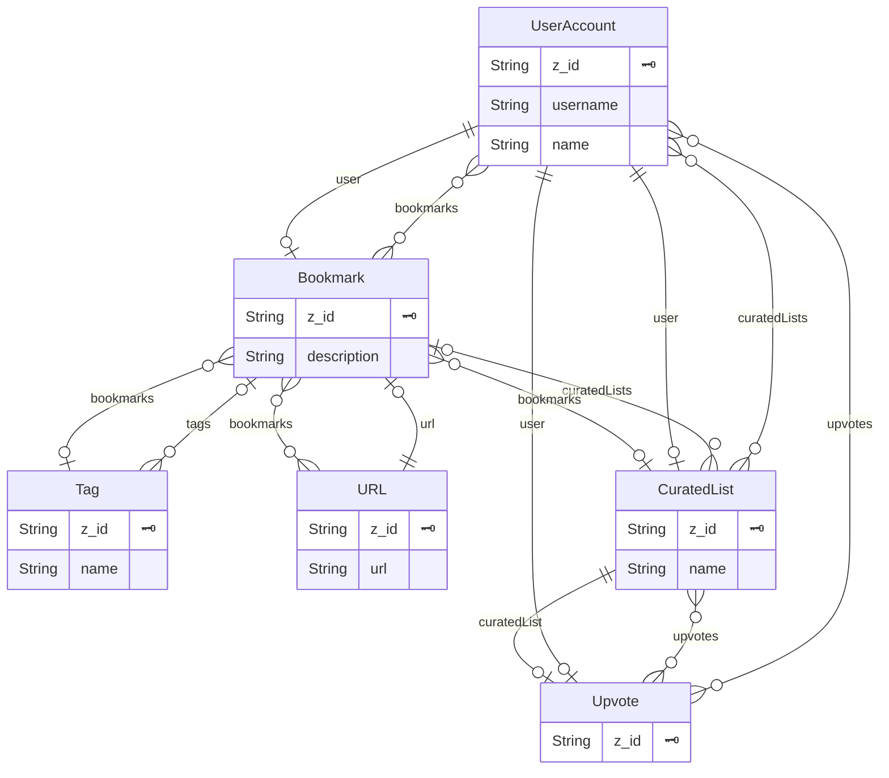

```mermaid
erDiagram

  "UserAccount" {
    String z_id "🗝️"
    String username 
    String name 
    }
  

  "Tag" {
    String z_id "🗝️"
    String name 
    }
  

  "URL" {
    String z_id "🗝️"
    String url 
    }
  

  "Bookmark" {
    String z_id "🗝️"
    String description 
    }
  

  "CuratedList" {
    String z_id "🗝️"
    String name 
    }
  

  "Upvote" {
    String z_id "🗝️"
    }
  
    "UserAccount" o{--}o "Bookmark" : "bookmarks"
    "UserAccount" o{--}o "CuratedList" : "curatedLists"
    "UserAccount" o{--}o "Upvote" : "upvotes"
    "Tag" o|--}o "Bookmark" : "bookmarks"
    "URL" o{--}o "Bookmark" : "bookmarks"
    "Bookmark" o|--|| "UserAccount" : "user"
    "Bookmark" o|--|| "URL" : "url"
    "Bookmark" o|--}o "Tag" : "tags"
    "Bookmark" o|--}o "CuratedList" : "curatedLists"
    "CuratedList" o|--|| "UserAccount" : "user"
    "CuratedList" o|--}o "Bookmark" : "bookmarks"
    "CuratedList" o{--}o "Upvote" : "upvotes"
    "Upvote" o|--|| "UserAccount" : "user"
    "Upvote" o|--|| "CuratedList" : "curatedList"
```
